# AXIGNAL — Arquitectura E2E de outputs, evidencia y comprensión humana

**Estado:** PROPUESTA ARQUITECTÓNICA / PRE_IMPLEMENTATION, preparada para revisión y posteriores slices Spec Kit. **Fecha:** 2026-10-05, Europe/Madrid. **Snapshot de código:** `27c4bb71f6839813d2172dbbad775ed708867454`. **Autoridad:** subordinada a MASTER, Constitución, ADRs aceptados y Atlas. Las responsabilidades aceptadas se conservan; las extensiones de contratos aquí propuestas no se convierten en autoridad por publicarse. **Resultado de este trabajo:** diseño, investigación y handoff; no implementación E2E ni despliegue.

El usuario ha fijado el propósito: outputs que permitan entender una Organización con lenguaje y UX Human First, fundamentados en evidencia. Para presencia escasa eligió ambas salidas: brecha documentada con recomendaciones condicionadas y diagnóstico después de investigar contexto. Se combinan en el mismo objeto, con distinta madurez, conservando las versiones anteriores.

**Aclaración del usuario, 2026-10-05:** Customer Zero interno es AXIGNAL usando AXIGNAL para probar y aprovechar sus outputs, incluida la observación de AXIGNAL. El E2E de producción empieza cuando un suscriptor registra 1, 2 o 100 Organizaciones para observación persistente. Nombre/URL son pistas de identificación de cada alta; el formulario interno no es la definición de la entrada de producción. Cada alta crea o recupera el Foco de observación correspondiente —Xeed en los identificadores internos existentes—, ligado a una Organización canónica cuando se resuelve su identidad.

**Validación de la entrega, incluida la aclaración Customer Zero:** `uv run axignal-governance` pasó architecture, deps, docs, graphify, hygiene, no-generated-data, spec y terminology. Se verificaron 94 destinos locales, las veinte secciones consecutivas y los bloques de código de los tres documentos nuevos. `git diff --check` pasó. El inventario conserva hashes del corpus previo a la entrega; `docs/README.md` es el único archivo inventariado cambiado por este trabajo. No se repitió la suite de producto para esta edición documental. Design mode: EXTEND arquitectónico; browser QA, Golden Master delta y human visual acceptance no se activaron porque no se cambió una superficie visual.

Se indexaron 388 documentos Markdown de `docs/` y `specs/` para navegación. Indexar no equivale a leer íntegramente cada documento. La revisión profunda se concentró en MASTER §§1–2, 14–23, 53–56; HFX; las especificaciones Subscriber, DRI, Admin, V2 y V3; Atlas/continuidad/interacción; brief generativo; ADRs y fuentes de código citadas. El [inventario con hashes](D:/AXIGNAL/Axignal/docs/research/e2e-outputs-2026-10-05/document-inventory.json) permite identificar el corpus; el [registro de decisiones y fuentes](D:/AXIGNAL/Axignal/docs/research/e2e-outputs-2026-10-05/DECISIONES_Y_EVIDENCIA.md) distingue evidencia, prestaciones externas y propuestas.

## 1. Objetivo: comprar comprensión persistente

La unidad de valor es entender qué puede saberse de una Organización, qué ha cambiado, por qué merece atención y qué lo respalda. El usuario dirige atención; el sistema observa, recuerda, contrasta y explica. «OaaS» se usa aquí en el sentido expresado por el usuario: servicio que entrega outputs útiles y evidencia. No establece otra unidad de facturación, una garantía de resultado comercial ni una modificación de los precios del MASTER. Las Señales siguen sin ser unidades facturables.

El objetivo arquitectónico es conservar corrección, procedencia y privacidad mientras mejora comprensión, frescura y economía de observación. No existe una tecnología que maximice todas esas dimensiones a la vez. «Mejor» debe demostrarse con la misma información, los mismos límites y tareas humanas representativas.

Un output puede tener valor sin una gran cantidad de datos: «No podemos describir todavía esta capacidad», «Las fuentes discrepan», «Tu organización no apareció en estas consultas», o «Hay una posible conexión y faltan estos requisitos». Estos resultados no rellenan artificialmente el panorama ni convierten ausencia de conocimiento en ausencia empresarial.

## 2. Soluciones que debe entregar el sistema

| Pregunta humana | Output y valor | Evidencia/requisitos | Límite que sobrevive a la UX |
|---|---|---|---|
| ¿Quién es esta organización? | Identidad resuelta o desambiguación comprensible | Identificadores, nombres, dominios y fuentes pertinentes | Marca, sede y entidad legal pueden diferir |
| ¿Qué ofrece y dónde puede actuar? | Productos/capabilities y alcance por capability | Declaraciones atribuibles, certificaciones/reach cuando existen | Sede no define mercado total; capacidad declarada no acredita capacidad operativa disponible |
| ¿Cómo la encuentran y describen? | Estado de representación por superficie y condiciones | Instrumento, consultas/prompts, detección de sujeto, muestra, raw permitido | API y UI son instrumentos distintos; representación no es realidad económica |
| ¿Qué podría mejorar? | Brecha explicada y diagnóstico condicionado | Estado económico, contexto de uso, representación comparable, alternativas | No atribuir automáticamente mala comunicación o pérdida de ventas |
| ¿Con quién está conectada? | Relaciones observadas, hipótesis y caminos separados | Partes, dirección, predicate, tiempo y admisión para observadas | Similaridad/capability match no crea cliente, lead ni relación observada |
| ¿Dónde hay una necesidad pertinente? | Oportunidad POTENTIAL con motivos, bloqueos y preguntas | Oferta, necesidad, reach, restricciones y estado suficiente | No probabilidad de venta ni score universal |
| ¿Qué cambió? | Cambio material frente a un corte identificado | Versiones compatibles, effective currentness y dependencias | Nuevo para AXIGNAL no significa nuevo en el mundo |
| ¿Qué experiencias se han declarado? | Patrones públicos por producto/sede/ventana | Observaciones permitidas, deduplicación, escalas nativas | Review no prueba el hecho narrado ni la calidad global |
| ¿Por qué debería creerlo? | Prueba navegable desde el output | Material exacto, provenance, contradicciones y reglas | Una cita decorativa no fundamenta cualquier frase |
| ¿Dónde lo dejamos? | Investigación restaurada y cambios desde el checkpoint | Memoria privada de pregunta/origen/corte | El origen ausente sigue UNKNOWN |

V1 ofrece observación viva y estas proyecciones según cobertura real. V2/AEAP interroga recursivamente ese conocimiento para un informe ejecutivo; V3 lo cruza con evidencia privada autorizada. V2/V3 son especificaciones propuestas, no capacidades desplegadas. Las slices internas no constituyen por sí mismas un producto de valor completo para vender. [Subscriber](D:/AXIGNAL/Axignal/docs/product/AXIGNAL_SUBSCRIBER_EXPERIENCE_ASK_AXENT_PRODUCT_SPEC.md), [V2](D:/AXIGNAL/Axignal/docs/product/AXIGNAL_V2_DEEP_REPORT_EXECUTIVE_ANALYSIS_SPEC.md), [V3](D:/AXIGNAL/Axignal/docs/product/AXIGNAL_V3_PRIVATE_CROSS_INTELLIGENCE_SPEC.md).

## 3. Arquitectura lógica y bucles

```mermaid
flowchart TD
  U[Suscriptor: añade 1 o N Organizaciones] --> C[Contexto autorizado y atención privada por Organización]
  C --> P[Prime: plan, frontier, derechos, presupuesto y parada]
  P --> S[Source Router e instrumentos: observar o investigar]
  S --> O[Observation Memory: raw permitido, intentos y tiempo]
  O --> R[Representación, identidad y estado suficiente]
  R --> J[Determinismo o juicio tipado reemplazable]
  J --> I[Interpretación económica Python y dependencias]
  R --> A[EvidenceAdmission exacta cuando corresponde]
  J -. soporte auxiliar .-> A
  A --> K[AXIGLAND: mundo canónico temporal]
  K --> I
  I --> F[Frontier: preguntas materiales pendientes]
  F --> P
  I --> H[Human Output Compiler y verificación]
  H --> Q[Proyección autorizada: significado, incertidumbre y prueba]
  Q --> G[UI Plan gobernado + registry + layout estable]
  G --> V[Panorama, Evidence, Evolution y AXENT / AI SDK 7]
  V --> C
  O --> T[Temporalidad y detección de cambio]
  T --> P
  T --> I
  P -. ejecución y costes .-> M[Learning Memory / Admin]
  H -. calidad y entrega .-> M
  C --> CM[Continuidad cognitiva privada]
  CM --> Q
  X[Evidencia privada opcional V3] --> XP[Plano analítico privado autorizado]
  K --> XP
  XP --> H
```



Es un sistema de bucles, no una cadena que obliga a pasar por LLM→Jev→admisión. Una fuente directamente atribuible puede evitar retrieval; un cálculo exacto evita modelo; una INXIGHT POTENTIAL puede ser útil sin crear nuevos FAXT. Una pregunta sin contexto provoca investigación o abstención. La presentación no reentra como evidencia del mundo.

Los seis ámbitos son: percepción; conocimiento/tiempo; razonamiento económico; outputs humanos; interacción generativa; operaciones del proveedor. Son límites de responsabilidad, no seis microservicios obligatorios. [Atlas](D:/AXIGNAL/Axignal/docs/architecture/AXIGNAL_LOGICAL_ARCHITECTURE_ATLAS_V0.1.md), [doctrina de discovery](D:/AXIGNAL/Axignal/docs/product/AXIGNAL_ECONOMIC_DISCOVERY_ENGINE_DOCTRINE_2026-09-30.md).

## 4. Autoridades y aislamiento

| Ámbito | Qué conserva | Qué puede decidir |
|---|---|---|
| AXIGLAND compartido | Identidad y conocimiento económico canónico, historia y provenance | Estado admitido y derivaciones gobernadas |
| Observation Memory | Lo adquirido bajo derechos, condiciones y tiempo | Registro de observación; no convertir claims en hechos |
| Contexto privado de observación | Foco, trabajo, permisos y referencias de un tenant/client | Atención y ejecución autorizada |
| Continuidad cognitiva privada | Preguntas, origen real, checkpoints y navegación significativa | Restauración y densidad de explicación |
| Plano privado V3 | Datos concedidos y análisis contextual por tenant/client | Hallazgos privados; nunca una copia privada de AXIGLAND |
| Admin de AXIGNAL | Operación, costes, billing, CRM interno y fiscalidad del proveedor | Comandos del servicio propietario bajo autoridad de staff |

La autorización se evalúa antes de recuperar contenido y de nuevo al liberarlo. Un ID de organización, una URL, una elección de modelo o una suscripción no concede acceso a datos privados. Client A y Client B siguen separados aunque observen la misma Organización. El cambio de cliente invalida requests/streams anteriores mediante context version.

El CRM interno autorizado por ADR-0055 opera AXIGNAL; no gestiona el negocio del suscriptor ni acredita relaciones de AXIGLAND. El registro AO-24 de medidas es privado Admin/advisory: reutilizar su patrón de contratos no lo convierte en autoridad universal de medición pública DRI. [ADR-0055](D:/AXIGNAL/Axignal/docs/adr/ADR-0055-admin-private-business-operations-separation.md), [ADR-0071](D:/AXIGNAL/Axignal/docs/adr/ADR-0071-governed-measurement-registry.md), [ADR-0076](D:/AXIGNAL/Axignal/docs/adr/ADR-0076-tenant-reuse-authorization-before-narrative-access.md).

## 5. Entrada, investigación y primera entrega

1. Un suscriptor registra una o varias Organizaciones para observación persistente, mediante altas individuales o un lote autorizado. El servidor autentica y resuelve tenant/client/membresía y los derechos/cupos del servicio que procedan. El alta no acredita propiedad ni representación de la empresa.
2. Por cada entrada valida las pistas disponibles de identidad, conserva idempotency key y devuelve aceptación, duplicado, desambiguación o rechazo con su causa. La identidad puede quedar pendiente sin fingir un sujeto resuelto; un homónimo pendiente no impide procesar las otras entradas.
3. Persiste o recupera el foco privado de cada Organización y su intención; devuelve su estado real. Una Organización canónica puede ser observada por varios suscriptores mediante focos privados distintos, sin duplicar la verdad compartida.
4. Comprueba conocimiento reutilizable por sujeto, purpose, derechos y effective currentness. Conserva el motivo de reuse o rechazo y agrupa trabajo público compartible cuando corresponde.
5. Prime selecciona preguntas y observaciones suficientes por foco dentro del presupuesto del servicio, del tenant y de la operación. Una cola con concurrencia acotada y reparto de capacidad impide que cien altas bloqueen a otros suscriptores o multipliquen adquisiciones equivalentes.
6. Worker durable adquiere fuentes autorizadas, registra todos los outcomes, genera representación verificable y calcula dimensiones answerable. La adquisición no mantiene un lock del catálogo ni exige que el navegador espere el scan completo.
7. Compone outputs parciales útiles por Organización: identidad, descripción sustentada, limitación de cobertura, brecha o pregunta pendiente. Readiness depende de utilidad y suficiencia declaradas para cada familia, no de un cronómetro o porcentaje decorativo.
8. Publica revisiones de proyección por Organización y una vista de cartera autorizada. La UI puede mostrar resultados disponibles sin esperar a las cien; cada elemento mantiene scope, estado y ruta a evidencia. El panorama se amplía conservando sujeto y continuidad.

### 5.1 Customer Zero interno

Customer Zero significa **AXIGNAL como usuario de su propio producto**. Puede usar el mismo Brain y la misma proyección de producto para testar y aprovechar información real. Observar AXIGNAL tiene la misma carga de evidencia que observar otra Organización. No es un mock ni una fuente alternativa de verdad.

El formulario interno «nombre y URL» y la autorización de staff pertenecen a esa entrada operativa. Su existencia no prueba que estén implementados identidad comercial, membresías, entitlements, altas masivas o aislamiento de suscriptores. Esas capacidades necesitan su propio recorrido y validación de producción. Reutilizar el motor no equivale a reutilizar un grant administrativo como permiso del suscriptor. [Appendix Customer Zero](D:/AXIGNAL/Axignal/docs/governance/AXIGNAL_ADMIN_CUSTOMER_ZERO_APPENDIX_2026-10-04.md), [spec AO-24A](D:/AXIGNAL/Axignal/specs/037-admin-customer-zero/spec.md).

### 5.2 Contrato de entrada de 1, 2 o 100 Organizaciones

La cardinalidad describe atención persistente del suscriptor; no implica cien bases de datos, cien entidades nuevas o cien llamadas simultáneas. Conservar estado por entrada y por foco; permitir reintento de fallos sin repetir las aceptadas; mantener pendientes de identidad separadas de observaciones económicas; y deduplicar el trabajo compartible sin mezclar datos privados.

«Lote de altas de Organizaciones» y «batch de preguntas Jev sobre un estado» son optimizaciones distintas. No reunir estados de cien empresas en un batch semántico por el mero hecho de haber sido registradas juntas. La vista de cartera tampoco amplía permisos por sí misma: sólo agrega outputs de focos autorizados.

«Primera entrega» y FIRST_MAP_WOW no justifican inventar nodos. En el caso de presencia escasa, la entrega puede ser una limitación informativa acompañada de una pregunta útil. Exponer un mapa vacío sin explicación transfiere trabajo cognitivo al humano; rellenarlo con hipótesis no etiquetadas rompe doctrina.

## 6. Percepción: fuentes e instrumentos

Un registro propuesto de fuentes/capabilities declara purpose, canal, superficie, sujeto/resolución, cobertura geográfica/idiomática, derechos, límites, retención, borrado, transmisión a proveedores, coste/unidad y estado operacional. Un instrumento de medición declara pregunta, protocolo versionado, queries/prompts congelados, detector de sujeto, conditions, réplica, muestra informativa y comparabilidad.

Fuentes distintas cubren preguntas distintas: registros para identidad legal; web atribuible para oferta declarada; documentos corporativos para estructura/resultados; contrapartes para relaciones; proyectos/procurement para actividad y necesidad; superficies digitales para representación; reviews para declaraciones públicas de experiencia. Un proveedor no define la semántica de ninguna familia.

HTTP condicional, fingerprints y comprobación de cambio reducen trabajo repetitivo cuando el canal lo permite. Discovery/research obtiene fuentes nuevas; sensores industrializan observación estable. Un browser se añade sólo para un requerimiento demostrado y autorizado. La instalación de un MCP no autoriza automáticamente todas sus herramientas.

Cada intento registra al menos run/parent, instrumento/version, condiciones, inicio/final, outcome, coste conocido/UNKNOWN, source ref y artifact permitido. Timeout, bloqueo, 403, error de detector, falta de permiso y ausencia en un resultado completo son estados distintos. La ausencia requiere conservar también el protocolo y el conjunto examinado, no sólo una lista vacía.

## 7. Presencia escasa: un output con dos niveles

### 7.1 Nivel inmediato: hallazgo y brecha documentada

La primera cuestión es «¿Encontramos al sujeto en las superficies y consultas que medimos?», no «¿La empresa hace mal marketing?». Se distinguen branded findability, representación de categoría/capability, cobertura geográfica, atribución correcta y disponibilidad del canal. No se suman para fabricar un score digital universal.

Ejemplo **sintético**, no medición de una empresa real: se planifican doce ejecuciones de búsqueda bajo un instrumento; ocho completan de forma informativa y cuatro fallan. En las ocho no aparece la entidad correctamente resuelta. El output puede decir:

> No encontramos a esta organización en las ocho búsquedas que pudimos completar bajo estas condiciones. Cuatro consultas quedaron sin medir. Esta muestra no permite concluir que carezca de presencia pública.

Las condiciones, consultas, límites del detector, fechas y resultados están accesibles en Evidence. El denominador es ocho, no doce. Un cero en la muestra es válido sólo si el instrumento lo define y la muestra es informativa; NOT_MEASURED/INSUFFICIENT llevan valor null. Un hallazgo de ausencia acotada se conserva como observación del instrumento; una RepresentationGap que cruza ese hallazgo con capacidad o relevancia económica es derivada y necesita basis.

Una recomendación inicial es condicional: «Si estas búsquedas corresponden a cómo tus compradores buscan esta capacidad, conviene revisar su representación». No afirma daño comercial ni una causa. Objetivos proporcionados por la empresa son contexto privado declarado, no verdad canónica.

### 7.2 Nivel investigado: diagnóstico y recomendaciones

AXENT abre preguntas materiales: ¿está bien resuelta la identidad/marca?, ¿son pertinentes las consultas y geografías?, ¿qué capability está sustentada?, ¿es el canal relevante para sus compradores?, ¿hay una explicación alternativa?, ¿las condiciones son comparables?, ¿qué evidencia permitiría discriminar hipótesis?

La investigación puede contrastar aliases/rebrand, indexabilidad observable, atribución, contenido sobre capabilities, canal de adquisición, mercado y referencias comparables. Una empresa con canal B2G especializado o distribución indirecta puede no necesitar la misma estrategia de presencia que un servicio local. Un bloqueo del sensor requiere reparar cobertura, no recomendar marketing.

El diagnóstico entrega: brecha y alcance; hipótesis contrastadas; soporte y contradicciones; restricciones; recomendaciones condicionadas; evidencia que falta; y un protocolo para verificar posteriormente cambios. No atribuye causalidad a SEO/GEO por un simple antes/después. La agencia o empresa actúa fuera de AXIGNAL; AXIGNAL reobserva con independencia.

### 7.3 Cómo saber qué nivel aporta más valor

Conservar ambos sobre el mismo output_id, con revisiones, fecha y estado. El resumen inicial sigue accesible; el diagnóstico amplía o corrige la interpretación sin reescribir el pasado. Abrir PROVE directamente sigue siendo posible antes del diagnóstico.

Comparar con usuarios: comprensión correcta y tiempo del nivel inicial; mejora de decisión y utilidad del diagnóstico; esfuerzo humano; coste incremental de investigación; correcciones; voluntad de recibir/financiar el nivel adicional. Un experimento con datos fijos puede aislar efecto de presentación. Otro debe medir valor de evidencia adicional; no atribuirle a la UX un efecto de haber aportado más información. No declarar vencedor antes de esa evaluación.

## 8. OpenSEO y Utopia: adopción por mecanismo

**OpenSEO:** candidato de sensor/laboratorio, especialmente para SERP, footprint, auditoría y comparación de presencia. Su MCP incluye lecturas y también operaciones de proyecto/publicación; la integración propuesta permite únicamente capabilities explícitas que cumplen los contratos de AXIGNAL. GSC permanece privado. El coste de datos y derechos del canal son distintos de la licencia del software. [MCP oficial](https://openseo.so/docs/mcp).

Comparar un adapter directo con OpenSEO como intermediario usando la misma pregunta: ¿preserva parámetros, raw permitido, task/run IDs, muestra, errores, coste y versiones?, ¿aporta funciones que compensan otro servicio y otra autoridad operacional? Un dato SEO transformado sin trazabilidad suficiente puede ser útil para exploración, pero no se convierte en medición comparable. «AI Visibility» requiere inspeccionar el instrumento concreto antes de asignarle semántica GEO. La propuesta no instala OpenSEO ni declara su integración ejecutada.

**Utopia:** referencia para tiempo, queries tipadas, provenance y correcciones. No se adopta como autoridad canónica o modelo de datos alternativo. Su documentación MCP distingue world time y record time y reconoce límites del proof histórico/export; esas limitaciones deben formar parte del bakeoff, no ocultarse por la presencia de un grafo temporal. [Contrato MCP](https://github.com/deeplethe/utopia/blob/main/web/src/docs/mcp.md).

Los detalles de integración, incompatibilidades, versiones y experimentos están en el [registro técnico](D:/AXIGNAL/Axignal/docs/research/e2e-outputs-2026-10-05/DECISIONES_Y_EVIDENCIA.md). La arquitectura funciona sin que un proveedor concreto esté disponible; informa de la cobertura que pierde.

## 9. Jev como motor semántico económico

El activo de AXIGNAL es su catálogo versionado de preguntas, information requirements, choice spaces/rúbricas y políticas de composición. Jev es candidato reemplazable para ejecutar dimensiones answerable sobre estado pertinente: oferta, compra, tipo de necesidad, relación/dirección, correspondencia funcional, soporte contextual, conflicto o relevancia. Noul para proposiciones independientes; Choice para alternativas excluyentes; Score para rúbricas ordinales. [Primitivas TypeSafe](https://docs.typesafe.ai/primitives).

Supplier y customer pueden coexistir. Identidad exacta, fechas, montos, counters, permissions y límites se calculan en Python. Se preservan raw answers/distributions, leyenda, model version, state/question/answer-space fingerprints, coste/latencia observados y disposición. Falta material se resuelve antes del proveedor; UNKNOWN no se vuelve un Noul false.

Preguntas independientes con el mismo estado pueden agruparse; un segundo ciclo obtiene datos que dependan de una respuesta anterior. Batch es transporte, no unidad indivisible de cache ni corroboración entre respuestas. Reuse/invalidación es por dimensión y sus inputs. [Fan-out](https://docs.typesafe.ai/patterns/fan-out).

El adapter local aún construye `[definition]` por llamada. La propuesta requiere variantes neutrales Noul/Choice/Score y un request-set con gate por dimensión; no forzar todo al puerto Choice existente. La selección productiva requiere corpus, derechos y comparación real. El [estudio Jev](D:/AXIGNAL/Axignal/docs/audits/brain-2026-10-04/JEV_ARQUITECTURA_Y_POTENCIAL_AXIGNAL_2026-10-05.md) desarrolla economía, defectos del lab y evaluación.

## 10. Memoria, identidad, tiempo y canonización

Identity Resolution conserva candidatos, aliases, scope y merges reversibles; la semejanza no es autoridad. Entity legal, marca, producto y sede se distinguen antes de atribuir ausencia o experiencia. Un sujeto ambiguo retiene UNRESOLVED y puede requerir desambiguación humana como atención, sin conceder edición de verdad.

Observation Memory conserva observaciones valiosas aunque no sean admisibles como FAXT. EvidenceAdmission autentica contenido y proposición exactos, autoridad por predicate, sujeto, valor, observación y policy. Factories/replay no aceptan una decisión para otro tuple. Un structured verdict aporta soporte auxiliar, nunca permiso de write. [ADR-0072](D:/AXIGNAL/Axignal/docs/adr/ADR-0072-proposition-bound-evidence-admission.md), [ADR-0073](D:/AXIGNAL/Axignal/docs/adr/ADR-0073-canonical-materialization-relationship-admission.md).

La extensión temporal propuesta distingue observed/retrieved time, valid time cuando esté sustentado y recorded time. Fecha de publicación no es fecha de inicio económico. Un dato tardío puede alterar qué sabemos ahora sobre el pasado, conservando qué sabíamos entonces. El valor temporal permanece UNKNOWN si la fuente no lo establece.

Effective currentness se calcula al consumir y proyectar, con as_of y policy version. Raw/history no se reescribe al envejecer. Una reobservación fresca no refresca silenciosamente el soporte de una señal vieja. Cambios de fuente, derechos, método, contrato o modelo invalidan las derivaciones pertinentes; el borrado puede dejar una referencia no disponible y limitar el replay. [ADR-0077](D:/AXIGNAL/Axignal/docs/adr/ADR-0077-temporal-currentness-propagation-at-consumption.md), [ADR-0079](D:/AXIGNAL/Axignal/docs/adr/ADR-0079-immutable-legacy-evidence-identity-replay-conflict.md).

## 11. Economic Reasoner y política de investigación

La oportunidad cruza capability, necesidad, roles, reach por capability, tiempo, restricciones y evidencia. Filtros duros rechazan sólo incompatibilidades demostradas; missing material no equivale a rechazo. Jev puede tipar correspondencia o actividad; Python compone disposition POTENTIAL, INVESTIGATE o abstención. Precio, certificación, disponibilidad, incumbente y acceso no aparecen por inferencia conveniente.

Research Value Gate controla derechos/capability, materialidad informativa, presupuesto, deadline y progreso. Una evaluación de relevancia es input reemplazable, no gobierno. El plan limita hops, número de tareas y concurrencia; la expansión del neighbourhood responde a valor informativo, no a completitud infinita.

Paradas explícitas: pregunta contestada con suficiencia; falta privada sin acceso; fuente no autorizada; reserva insuficiente; no progreso tras intentos delimitados; ambiguity irreducible; o deadline. Preservar pregunta, exploraciones y motivo de parada evita volver a pagar la misma investigación. Los outputs describen esa frontera sin fingir que el análisis terminó el mundo económico.

AXENT propone queries/fuentes, investiga huecos, contrasta alternativas y explica el basis. No posee SQL arbitrario, credenciales de base de datos o un escritor canónico. Sus tools son operaciones de un Context Broker autorizado y acotado. [Continuidad/contexto](D:/AXIGNAL/Axignal/docs/architecture/HFX_COGNITIVE_CONTINUITY_AND_MEMORY_ARCHITECTURE.md).

## 12. Human Output Compiler: la frontera que faltaba en la tesis E2E

«Human Output Compiler» es nombre de responsabilidad **propuesta**, no paquete implementado ni término canónico nuevo. Consume derivaciones y observaciones autorizadas; construye una representación semántica verificable antes de elegir componentes. Lo dirige application/subscriber_projection y preserva Human Output Contract de HFX.

Un contrato de wire candidato contendría:

```text
HumanOutput (propuesta v0.1)
  identity: output_id, revision, subject_ref, semantic_family, archetype
  context: authorized_scope_ref, context_version, locale, as_of
  state: epistemic_state, temporal_state, completeness, attention_reason_refs
  meaning: headline, one_sentence_meaning, why_it_may_matter
  basis: proposition_refs, derivation_ref/version, considered_evidence_refs
  measure?: definition_ref/version, value|null, unit, denominator,
            window, instrument_ref/version, conditions, uncertainty
  limits: unknowns, contradictions, withheld_claims, coverage_limits
  understand: context, drivers, blockers, comparison_ref?
  prove: authorized_evidence_targets, observation_refs, instrument_targets
  navigate: related_refs, evidence_target, evolution_target, research_question_ref?
  continuity?: investigation_ref, checkpoint_ref, recorded_origin_ref|null
```

Son ejes independientes: familia, estado epistémico, temporalidad, atención y arquetipo. No un estado combinado «bueno/malo». El modelo puede proponer palabras; el contrato exige referencias y conserva limitaciones materiales. La variante sin modelo usa copy determinista y mantiene utilidad.

Verificación previa a publicación: resolver sujeto y revisión; autorizar metadata antes de material; validar basis contra representación/extracción exactas; incluir contradicciones consideradas; comprobar cálculo/unidades/denominador/instrumento; resolver relaciones/caminos; verificar alcance de cada afirmación; preservar UNKNOWN y effective currentness. Material narrativo rechazado no se sustituye por una historia plausible. [ADR-0075](D:/AXIGNAL/Axignal/docs/adr/ADR-0075-exact-explainable-basis-narrative-verification.md), [HFX](D:/AXIGNAL/Axignal/docs/product/HFX_HUMAN_FIRST_COGNITIVE_UX_DOCTRINE.md).

Persistir output y versión de su basis permite replay, explicación y export coherentes. No es una segunda base de hechos: es proyección con refs a las autoridades originales. Markdown/JSON/Product MCP y UI consumen la misma revisión autorizada.

## 13. UI generativa gobernada con AI SDK 7

Se conserva el brief: LEFT navegación estable; CENTER canvas de observación adaptable; RIGHT AXENT contextual; BOTTOM tiempo global; TOP recorrido/back/forward. Today, Explore, Evolution y Evidence siguen siendo modos de comprensión. La experiencia básica entrega valor sin prompt. [Brief aceptado](D:/AXIGNAL/Axignal/docs/design/AXIGNAL_FRONTEND_BRAND_GENERATIVE_EXPERIENCE_MASTER_BRIEF.md).

AI SDK 7 es la dirección solicitada y ya está instalado (`ai` 7.0.127, `@ai-sdk/react` 4.0.130). La documentación oficial permite componentes propios asociados a salidas tipadas y streaming de data parts. La arquitectura aprovecha AI SDK UI; no presupone que Generative UI signifique JSX libre o un nuevo framework visual. [Generative UI](https://ai-sdk.dev/docs/ai-sdk-ui/generative-user-interfaces), [custom data](https://ai-sdk.dev/docs/ai-sdk-ui/streaming-data).

La propuesta E2E es:

```text
Authorized HumanOutput snapshot
 → task/depth/locale + optional semantic presentation hints
 → UIPlan proposal referencing existing outputs
 → deterministic validation against scope/revision/component registry
 → stable responsive layout
 → AI SDK typed stream / UI parts
 → React component render + accessible equivalent
```

UIPlan sólo selecciona refs y arquetipos disponibles: resumen, estado, cambio, comparación, oportunidad, gap, timeline, mapa, relación, tabla, warning y proof. Cada componente declara props, límites, accessibility, navegación y qué datos exige. Si no están, se usa unknown/insufficient/researching, no una variante con números inventados. Las medidas las calcula el productor; el modelo no las recompone desde texto.

Python conserva cognition/router + CognitiveProvider; SDK concretos productivos quedan en cognition/providers. Next/BFF transporta proyecciones y streams autorizados. AI SDK UI puede consumirlos sin mover el control del Brain al frontend. Cualquier ejecución generativa en un runtime TypeScript separado necesitaría adapter/puerto neutral revisado que conserve esa frontera; no introducir un segundo router de proveedores por conveniencia. Este diseño inicial no necesita esa duplicación.

La guía oficial considera AI SDK RSC experimental para producción estable y recomienda AI SDK UI. Por tanto, no basar el target en el histórico streamUI/createStreamableUI. Instalar el SDK no exige desplegar en Vercel. [Guía RSC→UI](https://ai-sdk.dev/docs/ai-sdk-rsc/migrating-to-ui).

## 14. Streaming, continuidad y estabilidad cognitiva

Separar ObservationRun del stream de presentación. El worker durable es dueño del trabajo económico; desconectar el navegador cancela o detiene su suscripción de UI según policy, no pierde el run. Cancelar una investigación es un comando explícito, versionado y presupuestado; no un efecto implícito de cerrar una pestaña.

Envelope propuesto por evento: request_id, context_version, subject_ref, projection_revision, output_id/revision?, event_id, sequence, kind y payload tipado. Eventos de progreso describen trabajo real. Una narrativa material sólo llega al estado publicable tras validación; las data parts de progreso pueden transmitirse antes. Una interrupción nunca deja una afirmación incompleta presentada como verificada.

La reconstrucción tras reconnect parte de una revisión persistida y secuencia; reautoriza. Ignorar respuestas de otro context_version y revalidar refs al recuperar historial. El SDK proporciona herramientas de protocolo, no el modelo de continuidad ni autoridad. Su guía recomienda validateUIMessages para tool/data/metadata antes de procesar mensajes; eso complementa la validación de scope/semántica propia. [Persistencia oficial](https://ai-sdk.dev/docs/ai-sdk-ui/chatbot-message-persistence).

Visual hysteresis y claves estables evitan que un cambio menor de prioridad reordene el canvas mientras la persona lee. Las actualizaciones materiales son visibles y reversibles; conservar foco, selección y breadcrumb. GLANCE→UNDERSTAND→REASON→PROVE permite acceso directo a cualquier profundidad. Densidad cambia con tarea/elección, no con una inferencia de rasgos psicológicos.

Checkpoint privado guarda pregunta, refs al entonces, pendientes y origen cuando existe; el transcript AXENT y el UI navigation log siguen separados. Borrar memoria privada o retirar derechos propaga a índices derivados y limita restauración; el sistema lo declara. El usuario puede revisar la versión que vio y la vigente, sin falsa continuidad temporal.

## 15. Acceso privado y diagnóstico contextual

La primera brecha no exige conectar cuentas. Si una pregunta concreta necesita datos privados, una solicitud contextual explica qué se quiere discriminar, recurso/property, ventana, alcance mínimo, read-only, propósito, duración, destinatarios/proveedores y qué puede concluirse sin acceso. Aprobar intención no sustituye OAuth ni verificación de permisos del proveedor.

Rechazar conserva el output público y bloquea sólo la rama dependiente. La conexión persistente muestra scope, estado, último uso y revocación; revocar corta futuros accesos y aplica retention/deletion de derivados. Scope no se amplía por contenido leído de una web. Credenciales no pasan por prompts ni transcript.

Search Console es evidencia privada contextual, no representación pública canónica. Su API advierte que devuelve top rows y no garantiza todas las filas: falta de una fila no acredita cero impresiones globales. [API oficial](https://developers.google.com/webmaster-tools/v1/searchanalytics/query). La propia GSC de AXIGNAL en Admin y GSC concedida por un suscriptor son autoridades privadas distintas.

Se aplicaron los principios de scoped grant, progressive scope, receipt y revocación de la [skill agent-consent-patterns](C:/Users/usuario/.codex-clean/plugins/cache/openai-curated-remote/agent-consent-patterns/0.1.1/skills/agent-consent-patterns/SKILL.md), subordinados a V3 §44 y contratos de interacción. No se instaló su librería ni se creó una conexión.

## 16. Topología física y economía

**Recomendación de arranque:** monolito modular Python con límites existentes, web Next/React existente y ejecución de workers separable del HTTP interactivo. Puertos de storage, queue y provider permiten evolución. No empezar con Kafka, graph DB, vector DB y varios agentes con ledgers duplicados por considerarlos «arquitectura avanzada».

Actual: SQLite/CAS y adapters delimitados. Candidato para multiworker/producción futura: PostgreSQL + almacenamiento de objetos permitido, queue/outbox transaccional y search derivado. Es hipótesis física, no selección aceptada ni migración ejecutada. Medir concurrencia, locking, deduplicación, filtered recall, path queries, aislamiento, restore y coste antes de fijar infraestructura. Sigma/Graphology mantiene la elección inicial del renderer de ADR-0009; no decide almacenamiento canónico.

La semántica de delivery es at-least-once con idempotencia y replay, no una promesa de exactly-once sobre red/modelos. Estado+outbox se escriben juntos cuando corresponda; lease expiry, fencing token, retry acotado y unique work key previenen trabajo/commits de workers obsoletos. La idempotencia de efectos no garantiza que un proveedor no facture un request repetido; intentos y reconciliación lo registran.

Reservar coste/deadline antes de dispatch para fetch/search/model/storage significativo. UNKNOWN permanece incompleto junto a lower bound conocido; no se recupera como cero. Usage por run/operation/dimension alimenta Learning Memory y proyección unit economics existente. Distinguir coste compartido real de asignaciones privadas; moneda y tipo de conversión fechados. Batch y reuse por cambio reducen costes sin dispensar derechos ni frescura.

La escalabilidad depende de fuentes únicas pertinentes, tasa de cambios y fan-out, además de número de Organizaciones. Dos tenants que observan un sujeto reutilizan evidencia pública autorizada; sus preguntas privadas y prioridades pueden diferir. No ejecutar todas las superficies DRI todos los días por empresa sin valor informativo y envelope financiero.

## 17. Seguridad, calidad y operación como parte del output

| Riesgo | Control target | Resultado humano correcto |
|---|---|---|
| Homónimo/brand mismatch | Resolución multiclave y sujeto por observación | Desambiguación; diagnóstico withheld |
| Canal bloqueado o indisponible | Attempt tipado y coverage explícita | «No pudimos medir esta superficie» |
| Prompt injection en web/MCP | Datos separados de instrucciones, allowlist de tools, scopes mínimos | No acción/autoridad adquirida por una fuente |
| Juicio malformed o fuera de rubric | Validación por primitiva y replay exacto | Dimensión no disponible; no false por defecto |
| Hallazgo stale | Effective currentness al consumo y deps | Histórico/stale; propuesta de reevaluación |
| Cambio de instrumento | Comparability gate y bridge sólo validado | Discontinuidad; no trend ficticio |
| Otra persona/cliente en stream | Context version + reautorización/release gate | Respuesta descartada antes de render |
| Narrativa omite contradicción | Considered-evidence ledger y verificación | Conflicto visible o output rechazado |
| Research sin progreso/presupuesto | Research Value Gate y stops con receipt | Pregunta pendiente y motivo explícito |
| Fallo de modelo | Composición/copy determinista y estado unavailable | Acceso a evidencia y panorama básico conservado |
| Retirada de derechos/raw | Tombstone/ref restringida y invalidación | Prueba no disponible; límites de replay visibles |

La observabilidad une trace_id→source attempts→representations→judgments→derivations→outputs→delivery. Registrar pérdidas por boundary distingue source miss, parser loss, retrieval miss, state insufficiency, evaluator error, policy error, admission rejection y fallo de comprensión. Una métrica UX no sustituye correcta evidencia; un gate técnico verde no demuestra comprensión.

Admin pregunta si el servicio entrega outputs actuales y fundamentados, cuánto cuesta, qué familias carecen de cobertura, qué research se repite y qué quedó bloqueado. Mantiene sus propias métricas y permisos; no ofrece editar una organización del mundo económico.

## 18. Fotografía actual y delta hacia el target

Inspección de código, no nueva verificación runtime E2E. Los documentos de septiembre contienen estados históricos que pueden quedar por detrás de ADRs/código posteriores; no tratar todo el gap ledger como fotografía actual.

| Pieza | Evidencia local actual | Delta target |
|---|---|---|
| UI / AI SDK | [package](D:/AXIGNAL/Axignal/apps/web/experience/package.json), [stream](D:/AXIGNAL/Axignal/apps/web/experience/app/api/axent/route.ts), [plan validator](D:/AXIGNAL/Axignal/apps/web/experience/lib/governance.ts) | SDK7 y composición limitada existen; generalizar desde contexto/demo a outputs del Brain autorizado sin fixture fallback |
| UX runtime | [runtime AXENT](D:/AXIGNAL/Axignal/apps/web/experience/lib/runtime-axent.ts), [projection contract](D:/AXIGNAL/Axignal/apps/web/experience/lib/runtime-projection.ts) | Explicación determinista e intents regex; faltan investigación/evaluación semántica y continuidad completa |
| Primera fuente | [FirstProof](D:/AXIGNAL/Axignal/tools/runtime/first_proof.py) | Homepage/persistencia/proyección acotadas; capabilities y markets aún vacíos en ese read model; no demostrar con ello un Brain económico completo |
| Proveedores | [router](D:/AXIGNAL/Axignal/cognition/router/router.py), [protocol](D:/AXIGNAL/Axignal/cognition/providers/base.py), [Jev lab](D:/AXIGNAL/Axignal/experiments/decision_lab/providers/typesafe.py) | Router explícito básico; Jev single-question experimental, no vector productivo compuesto |
| Contratos de Brain | [brain_contracts](D:/AXIGNAL/Axignal/application/economic_discovery/brain_contracts.py), [Prime execution](D:/AXIGNAL/Axignal/application/economic_discovery/prime_execution.py) | Reusar dimensiones/deps/control; completar mixed-primitive batch, persistencia/replay y ejecutores reales |
| Memoria | [observations](D:/AXIGNAL/Axignal/pipeline/observation_memory/sqlite_store.py), [learning](D:/AXIGNAL/Axignal/pipeline/learning_memory/sqlite_store.py) | Existen stores delimitados; composición durable/scheduler/output revisions requieren trabajo |
| Evidence / narrative | [admission](D:/AXIGNAL/Axignal/domain/evidence/admission.py), [narrative verification](D:/AXIGNAL/Axignal/application/subscriber_projection/narrative_verification.py), [access](D:/AXIGNAL/Axignal/application/subscriber_projection/narrative_access.py) | Hardening posterior al audit ya tiene contratos/código; preservar y extender, sin declarar vigentes todos los P0 históricos |
| Tiempo | [currentness](D:/AXIGNAL/Axignal/application/economic_discovery/temporal_currentness.py), FirstProof + ADR-0077 | Aging al consumo y refs concretas existen; scheduler y rederivación general no quedan demostrados |
| Medidas | [AO-24 model](D:/AXIGNAL/Axignal/domain/admin_measurements/model.py), [service](D:/AXIGNAL/Axignal/application/admin_measurements/service.py) | Patrón implementado en plano privado; instrumento DRI y primera definición pública requieren su propio contrato |
| Oportunidad | [market entry](D:/AXIGNAL/Axignal/application/economic_discovery/market_entry.py), [explanation](D:/AXIGNAL/Axignal/application/economic_discovery/explanation.py) | Contratos de razonamiento útiles; falta vertical real desde necesidad/capability hasta comprensión humana |

La anterior auditoría sigue siendo evidencia de su snapshot, no permiso para repetir conclusiones obsoletas. Esta propuesta no declara que existan integraciones OpenSEO/Utopia ni resultados de precisión/latencia con Jev.

## 19. Implementación incremental y demostración E2E

Orden por dependencia de valor; detalle en el [handoff](D:/AXIGNAL/Axignal/docs/research/e2e-outputs-2026-10-05/IMPLEMENTATION_HANDOFF.md). Cada feature no trivial sigue specify→clarify→plan→architecture review→tasks→implement→converge. Este documento es entrada a ese proceso, no reemplazo de sus gates.

| Slice | Entrega verificable | Dependencias / criterio de salida |
|---|---|---|
| E0 — Contratos y baseline | Output contract, instrumentos, scope, dataset y pérdidas por boundary | Congelar fixtures rights-cleared/sintéticas; ninguna UI inventa truth o progreso |
| E1 — Run durable y presupuesto | Atención rápida, worker/recovery, intentos completos, reserva/reconciliación | Deadline/cancel/crash/replay; cero double commit y costes incompletos honestos |
| E2 — Primera brecha | Identidad+presencia acotada→hallazgo→HumanOutput→Evidence | Denominadores y fallos correctos; UNKNOWN/coverage en la misma UI; adapter de fuente reemplazable |
| E3 — Jev económico | Batch mixto, vector por dimensión, coste/replay/reuse | Sanidad lab; corpus autorizado; roles coexistentes; comparación real y abstención |
| E4 — Diagnóstico contextual | Research sobre brecha→alternativas→recomendaciones condicionadas | Stops/value gate; contraste de canal/objetivos y explicación ligada a fuentes |
| E5 — UI generativa/continuidad | Plan de componentes sobre outputs reales y checkpoint | Context switching seguro, layout estable, proof directo, accessible complement |
| E6 — Oportunidad y evolución | Capability–need/reach→POTENTIAL→nueva observación→reevaluación | Procurement no cliente; inferencia visible; cambio limitado a deps; historial conservado |
| E7 — V2/V3/advisory | Análisis recursivo y privado cuando su scope se implemente | AEAP/full-value release; firewall y consentimiento; no contaminar AXIGLAND |

Una slice no obliga a comprar APIs ni desplegar. Tests contractuales y transport stubs prueban fallos deterministas; ensayos live posteriores exigen proveedor/datos/corpus autorizados y usage real. Human visual acceptance aplica sólo cuando se cambie materialmente una superficie; aquí no se altera el Golden Master.

## 20. Qué significa que la arquitectura funciona

La verificación E2E de producción comienza con suscriptor autenticado y alta de 1, 2 y 100 Organizaciones. Probar aceptación parcial, duplicados/reintentos, identidad pendiente, presupuesto, reparto de capacidad, aislamiento entre suscriptores y conocimiento público compartible. Customer Zero prueba uso interno del producto y no sustituye estos casos.

Sobre esas altas exige cuatro recorridos conectados con traces y evidencia: organización desconocida con cobertura suficiente; presencia escasa y cobertura incompleta; capability+necesidad con oportunidad POTENTIAL; y regreso posterior con cambio real/currentness. Añadir variantes contradictorias, homónimos, cliente cambiado durante stream, proveedor caído, instrumento cambiado y presupuesto agotado.

Gates de verdad/seguridad son independientes del modelo: no canonical bypass; no leakage; permisos antes de payload; UNKNOWN sin conversión; clocks/replay íntegros; errores de medición sin cero inventado; cada afirmación material con basis autorizado. Los gates requeridos del repo permanecen deterministas y offline.

Gates de servicio se fijan antes del piloto con baseline: time-to-first-useful-output; age/delivery lag; recovery; complete cost coverage; coste por output útil/reutilizable; pérdida de candidatos por capa; precisión/risk–coverage por dimensión e idioma. No prometer p95, throughput, coste global o proveedor ganador sin workload medido.

Gates humanos siguen el [protocolo de diez segundos](D:/AXIGNAL/Axignal/docs/design/FIRST_VIEW_10_SECOND_COMPREHENSION_PROTOCOL.md) y [HFX research](D:/AXIGNAL/Axignal/docs/research/HFX_USER_RESEARCH_AND_VALIDATION_PROTOCOL.md): identificar significado, relevancia, certeza, cambio, límites y ruta a evidencia; acceso experto sin perder contexto; restauración sin origen inventado. Today respeta su máximo actual de tres ítems primarios. Una UX atractiva sin comprensión epistémica falla.

La hipótesis competitiva es que memoria económica y memoria de comprensión se amortizan juntas: observar una vez cuando procede, componer muchas preguntas, explicar a distintas profundidades y recordar dónde estaba la persona. El valor acumulativo debe demostrarse en utilidad y coste, conservando independencia de la observación. Esa es la tesis E2E que este diseño convierte en responsabilidades, contratos y slices revisables.
