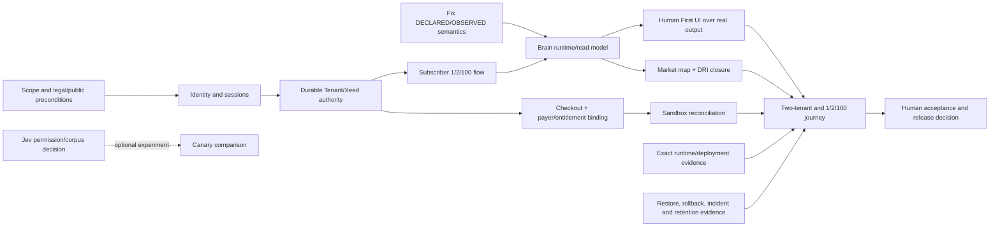

# Master roadmap — single reconciled closure path

Campaign `AXIGNAL-PR-2026-10-06-01`; source roadmaps remain authoritative for implementation order. This file is the audit's consolidated dependency view, not a replacement for the EB/FR/AO roadmaps.

## Release scope decisions to make

The commercial scope tested here is a paying subscriber registering 1, 2 or 100 Organizations; private focus/tenant isolation; truthful economic outputs with explainable evidence; Human First presentation; continuity/re-evaluation; safe provider and operating boundaries. The audit does not assume all research experiments ship in the first slice. Jev evaluation is a separately blocked experiment, not a dependency of deterministic Brain operation. The currently implemented EB-04 B2B path may be treated as the reference vertical only if the product owner explicitly accepts that bounded launch scope; the MASTER's broader B2B/B2C/B2G market-intelligence capability must otherwise remain on the path to closure.

Do not claim broad readiness by quietly moving core Brain, evidence, or Human First outputs to “later.” Record any bounded initial offer and excluded capabilities as a human-approved scope decision with exact product copy.

## Dependency path

## Phases and reconciliation

| Phase | Required outcomes | Existing roadmap alignment | Gate |
|---|---|---|---|
| 0 — Bound the release | Approve first subscriber offer and exact 1/2/100 contract; resolve public operator identity/legal publication condition; name runtime candidate | MASTER + AO-10/AO-29/AO-30; release evidence per FR-30 | No capture/account/contract activation until public precondition and allowed scope are evidenced |
| 1 — Correct product truth and authority | Fix BRAIN-01; implement identity/session and durable subscriber Principal→Tenant→Xeed path; no Admin/SSH substitution | Spec 022/ADR-0018; IDT-01/02; EB-00 guardrails | Cross-tenant negative tests and lifecycle/revocation pass with production-shaped persistence |
| 2 — Register and charge | Implement per-Organization pending/resolved focus outcomes, idempotency/partial failure/limits for 1/2/100; server-owned checkout; payer↔subscription↔Tenant/Xeed cardinality; sandbox webhook/reconciliation | AO-10 (BLOCKED), AO-11 (NOT_STARTED), identity specs | Test-mode purchase through invoice/renewal/cancel/refund and correct entitlements, without cross-tenant grants |
| 3 — Deliver the product | Route authorized observation/Prime through economic Brain and Evidence Basis into one subscriber read model, then typed AI SDK/UI plan; keep canonical copy/evidence server-owned; produce persistence/freshness states | EB-00..08 and FR-30/EB-08; MEMORY-01, UX-01 | Two test Tenants can inspect shared public Organization with private focus separation, exact evidence and no unsupported claims |
| 4 — Verify sustained operation | Bound actual attributable cost; live config/release SHA/digest/health; restore drill/rollback; security/privacy applicability/retention/incident sign-off | AO-28..31, AO-29; FR-30/EB-08 | Measured release candidate, recovery and privacy/security evidence; production runtime values not inferred from manifests |
| 5 — Expand and validate value | Compose B2B/B2C/B2G Market Map, instrumented DRI gap + conditioned diagnostic, valid research/canary; evaluate UX and price with human/economic evidence | EB-04/05/07, AO-11/13/30 | Maintain separate opt-in evidence, denominators, costs and human acceptance; unknown results stay unknown |

## Roadmap ownership boundary

Keep EB/FR as the economic/runtime workstream and AO as AXIGNAL's private first-party operating system. Link AO-10 to commercial checkout; AO-29 to operating security/recovery; AO-11/30 to actual economics. Do not force AO-13/GSC, AO-27 Admin MCP, Jev, V2/AEAP, or V3/private cross-intelligence into the critical path unless the approved launch offer promises them. Their state and authority must still be visible; product owner chooses scope.
