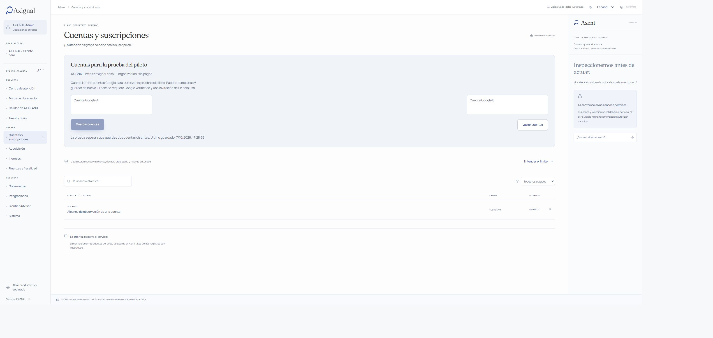
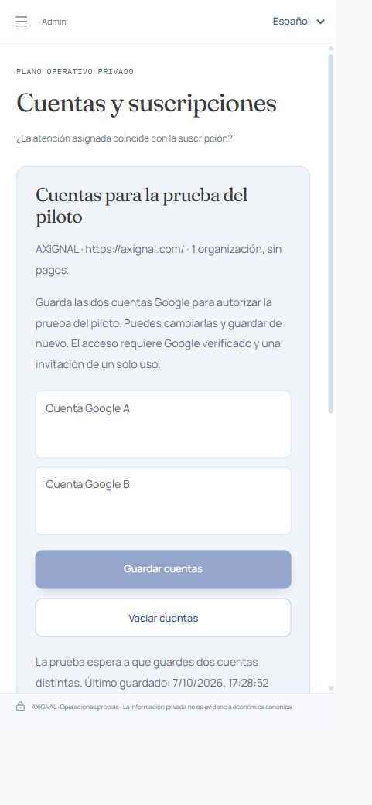

# Pilot test account preparation — CTO handoff

This extension completes explicit, durable Save in **Admin → Cuentas y suscripciones**. Both Google fields default to empty, can be replaced and can be cleared with another Save. A saved distinct pair authorizes the planned test only. It never grants subscriber access, links identity, sends invitations, changes Tenant/PilotGrant/Billing, starts observation or mutates AXIGLAND. The latest revision applies to future test preparation.

## Review and integration boundary

Final base: `282530cd9cdc1cf0c6f98462e0600ab3401eca31` (SEO batching hotfix #157), containing Product MCP at `83f3000ae1650685e803a801b2eaa3173c455155` (PR #156). Branch: `codex/pilot-test-accounts-save`. The PR body supplies the final head, image identities, isolated preflight evidence and completed validation results. CTO owns merge, main integration and canonical cutover.

Rebase conflicts were limited to `tools/runtime/service.py` (adjacent methods/POST dispatch) and `apps/web/experience/lib/translations.json` (appended keys). Both additions were retained. MCP modules, OAuth/PKCE, edge configuration, `/account/connect`, PilotGrant/Billing entitlement, tenant isolation and read-only behavior are unchanged from main. The integration regression includes the MCP audit/model-call assertions (`model_calls = 0`) and AST prohibition on model dependencies.

## Persistence and authority

- Operator metadata resides in `admin-pilot-accounts.sqlite3`, separate from subscriber stores and canonical truth. Revisions retain operator/time and reject stale writes atomically.
- Every read/save checks the current AO-01 session and CUSTOMERS_READ/WRITE scope, including revocation. Missing authority is rejected before opening the preparation store.
- The Next proxy uses the existing HttpOnly Admin cookie, a fixed internal endpoint, same-origin writes, a 2048-byte body limit, strict schemas and no-store responses.
- Admin origin validation retains the configured host and the documented loopback SSH Admin endpoint `127.0.0.1:18182`/`localhost:18182`. Host equality remains mandatory. Subscriber/MCP origin handling is unchanged.
- Runtime restart, concurrent writers, replacement, clearing, invalid/duplicate addresses and session/scope revocation are covered by real HTTP/SQLite tests.

## Reproducible validation

Run from the worktree root, using new basetemp directories belonging to this task:

```powershell
uv sync --frozen
uv run ruff format --check .
uv run ruff check .
uv run mypy
uv run architecture-guard --root .
uv run axignal-governance
uv run pytest tests/integration/test_admin_pilot_accounts.py tests/integration/test_subscriber_composition.py tests/integration/test_subscriber_http.py tests/integration/test_product_mcp_e2e.py tests/contracts/test_product_mcp_edge.py tests/contracts/test_product_mcp_http_socket.py tests/product_mcp/test_oauth.py --basetemp=D:/AXIGNAL/.tmp-pilot-closure-20261007/pytest-fixed-clock-focused -q
uv run pytest --basetemp=D:/AXIGNAL/.tmp-pilot-closure-20261007/pytest-full-fixed-clock
```

From `apps/web/experience`:

```powershell
npm test
npm run typecheck
npm run check:i18n
npm run build
```

Focal Python: **62 passed**. Experience: **123 passed**; typecheck/build passed; i18n **1409 entries, 0 missing**. Build includes `/account/connect` and the new Admin API. Ruff, mypy (404 sources) and Architecture Guard passed. The full suite passed (1690 tests) and governance passed. Exact candidate/preflight identities and final focused results are recorded in the PR body.

The first post-rebase full run reported **1689 passed, 1 failed** in 386.56 s. The sole failure used wall-clock time for a billing evidence timestamp only one second in the future; SQLite/scheduling could consume that second. The isolated test passed. Its fixture now injects a fixed Clock through the existing composition port; stale/future/mismatched-evidence assertions, the one-second case and production entitlement logic are unchanged. The fixed-clock full rerun passed: **1690 tests in 388.46 s** on `c3f3822aa56b3da46182a562066c3460629c4ba0`. No gate or runtime time tolerance was weakened.

Graphify was refreshed offline after the rebase (AST extraction, no LLM dependency). The final validation process retains its logs under the task-owned external evidence directory; no real accounts, sessions or secrets enter Git or CI.

## Rendered panel evidence

Chrome against the own local Next/runtime: blank defaults, duplicate rejection preserving the draft, corrected save, reload persistence, clear plus Save, and keyboard Tab from account B to Save were exercised. Both fields were cleared and saved at the end. The synthetic test addresses are not deployed preparation data.

Desktop and narrow screenshots follow the existing Admin geometry. The narrow override requested 390 × 844; measured CSS viewport was **433 × 937**, with scroll width 433 (no horizontal overflow), and both buttons about **330 × 50 CSS pixels**. The viewport was reset afterwards. This is rendered verification of the changed panel; T007's full real subscriber journey and human visual acceptance remain separate.





## Pilot acceptance boundaries

| Surface | Confirmed evidence | Real production E2E |
| --- | --- | --- |
| Login / session | Controlled verified-OIDC adapter; real HTTP creation, hashed storage, restart/replay/revocation | Google A/B not executed: accounts intentionally unavailable |
| PilotGrant / entitlement | Existing one-use invitation, principal/Tenant binding, capacity 1, expiry/revocation; Billing coexistence and MCP checks | Real partner redemption pending |
| Tenant / isolation | Cross-Tenant output, portfolio and MCP authorization regressions | Real Google tenant A/B pending |
| Xeed / persistence | Existing subscriber composition, authorized add/reobserve/read/restart; fail-closed observation readiness | First real Xeed and its complete reading pending |
| Account UX | Shared subscriber surface retained; `/account/connect` remains in build | Real authenticated journey pending |
| Admin UX / errors / responsive | Save/reload/clear, duplicate recovery, revocation/conflict tests; desktop/narrow/keyboard | Changed panel rendered locally |

## Isolated production preflight and CTO sequence

Build the exact PR head from a Git archive into its own candidate directory. Use unique names labelled `pilot-save-preflight`, a fresh isolated data directory, an internal-only Docker network, no published ports, no production data and no OAuth/provider secrets. Verify image revision labels, all three health endpoints, subscriber/account routing, exact MCP/OAuth/discovery routes and Admin non-exposure. An unauthenticated internal Admin request must return 401. Real Google is expected to be unavailable without credentials; that is not real OIDC acceptance.

Inspect existing containers and their SHA/purpose before starting any candidate. Do not reuse or stop the MCP or prior pilot preflights. Do not change `current`, `DEPLOYED_SHA`, canonical containers, production persistence or provider credentials. Record before/after identities in the isolated evidence. The earlier preflight using copied production data plus Google credentials was rejected by automatic approval review and was not executed; the independent no-data/no-secret alternative is used.

Required private flags are:

```text
AXIGNAL_SUBSCRIBER_ENABLED=true
AXIGNAL_SUBSCRIBER_PILOT_ENABLED=true
AXIGNAL_SUBSCRIBER_CONTRACTING_ENABLED=false
AXIGNAL_STRIPE_LIVE_ENABLED=false
AXIGNAL_PUBLIC_LAUNCH=false
```

After CTO review/integration/cutover, the operator can save A/B in Admin, complete real Google sign-in, then issue/redeem the existing single-use invitation mechanism. Never publish invitation tokens, substitute email authority or seed subscriber identity from these fields. Run the real first-Xeed/session/second-Xeed denial/A-B isolation/browser journey with those accounts.

The inspected host configuration contains the private flags, but its incumbent edge returned Landing HTML for `/api/auth/status`, `/mcp` and OAuth discovery: the prepared subscriber overlay was not effective on that canonical edge at inspection. `current` and image SHA differed from the stale `DEPLOYED_SHA` record. These are CTO cutover/release-identity checks, not permission to change live production during this task.

Real initial/autonomous observation also awaits authorized server-owned attention/source context and enrollment for the real Tenant/Xeed. The inspected `/etc/axignal/observation-runtime/attention.json` and `enrollment.json` were absent; no real first/second tick is claimed. Brain geographic reasoning is unchanged. Missing context remains NOT_READY/UNKNOWN; no markets, source rights or observations are fabricated.

## Unit economics limit retained from the existing pilot closure

FR-26 projects LearningEvents by Xeed with explicit shared/private allocation and preserves missing cost as UNKNOWN. Adaptive subscriber research can append events for its authorized Xeed; autonomous runtime retains requests/outcomes. Luna reports measured token/latency usage, but subscriber AXENT does not durably attribute that usage to FR-26. Observation-loop/JEV/acquisition/storage paths do not yet form a complete per-Tenant monthly ledger. This is a broader accounting boundary, not a missing pilot entitlement adapter; it was not redesigned here. Real accumulated/monthly Xeed cost and margins remain unmeasured, with no invented zeros or estimates.

## Final base reconciliation

Before PR creation, main advanced with #157. Its only changes are the SEO sync timer, its runner, deployment README and their existing contract test. Rebase was conflict-free; there are no subscriber, MCP, Admin, runtime or frontend implementation changes from that hotfix. The final affected SEO contract and pilot/MCP tests are rerun, and the exact final head is built and preflighted independently. The original full-suite result is retained with its SHA instead of misattributed to the rebased commit.
